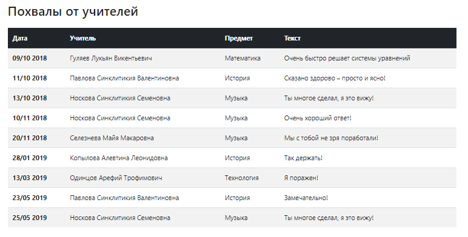

# Скрипт позволяющий в БД: 

- Изменять оценки ученика;
- Удалять замечания;
- Добавлять благодарность.

## Как запустить

1. Перенесите файл ``` script.py ``` в директорию с ``` manage.py ```.
2. Запустить ``` shell ```, следующей командой:

```python
python manage.py shell
```


1. Импортировать в ``` shell ``` сам скрипт, следующей командой:

```python
from script import fix_marks, remove_chastisements, create_commendation
```


4. После этого, вы можете использовать все возможности скрипта.

## Использование функций

### Изменение оценок

- В терминале вводите следующую команду:

```python
fix_marks(name)
```

Где ``` name ``` - ФИО обучающего


### Удаление замечаний

- В терминале вводите следующую команду:

```python
remove_chastisements(name)
```

Где ``` name ``` - ФИО обучающего


### Добавление благодарности

- В терминале вводите следующую команду:

```python
create_commendation(name, subject)
```

Где ``` name ``` - ФИО обучающего, 
    ``` subject ``` - Название предмета


### Итоги

После срабатывания всех функций, у вас в карточке исчезнут замечания, поменяются оценки и добавится похвала от преподавателей




## Как устновить 

Python3.* должен быть уже установлен. 
Затем используйте `pip` (или `pip3`, если есть конфликт с Python2) для установки зависимостей:

```python
pip install -r requirements.txt
```
